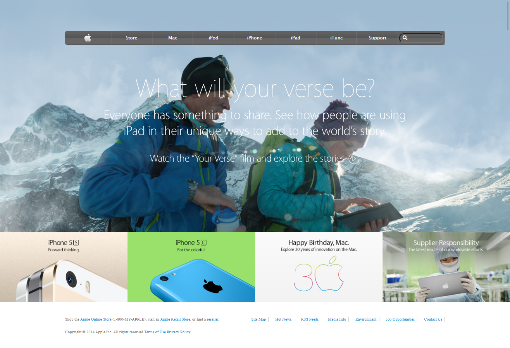

# Apple-Clone
> This project contains a clone of an old apple.com's webpage.

## Built With

HTML
- Designed in Semantic HTML style.

CSS
- Use of Gradient backgound.
- Use of flex layout
- Use of grid layout
- Use of float

## Live Demo

[Live Demo Link](https://div685.github.io/Apple-Clone/)

## Getting Started

**User has to clone the repository and run index.html file using any web browser*

## Authors

👤 **Anas Siddiqui**

- GitHub: [Anas Siddiqui](https://github.com/smcommits)

👤 **Divyesh Patel**
- GitHub: [@Div685](https://github.com/Div685)
- Twitter: [@div_685](https://twitter.com/div_685)
- LinkedIn: [Divyesh Patel](https://www.linkedin.com/in/divyesh-patel-2a15a6107)

## 🤝 Contributing

Contributions, issues, and feature requests are welcome!

Feel free to check the [issues page](issues/).

## Show your support

Give a ⭐️ if you like this project!

## Acknowledgments

- Icons and Images are downloaded from apple's original [webpage](https://web.archive.org/web/20140301004610/http://www.apple.com/).
- Fonts are imported from Google Fonts.

## 📝 License

This project is [MIT](lic.url) licensed.
